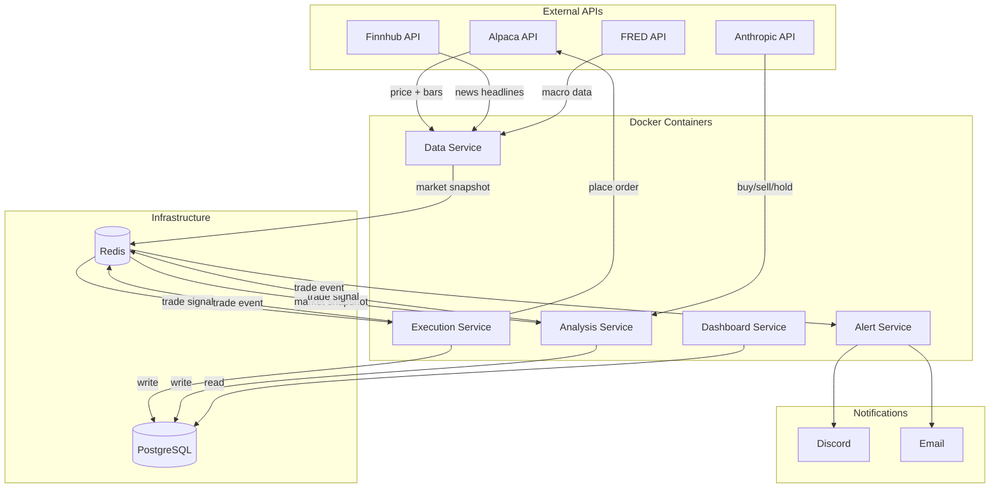
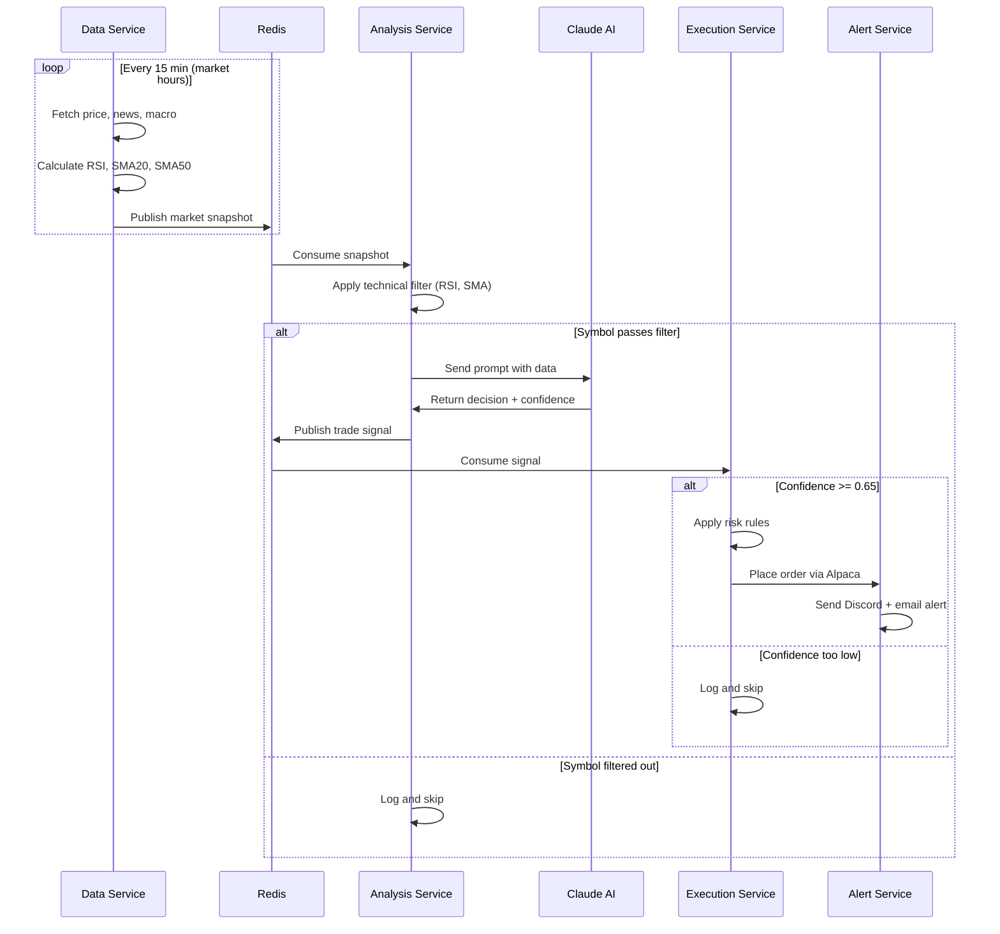
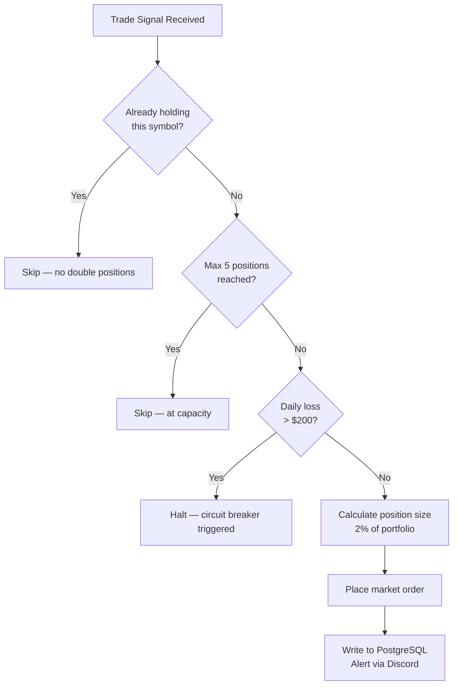
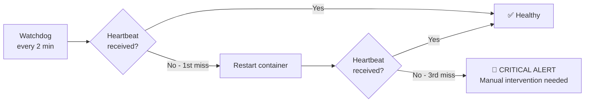
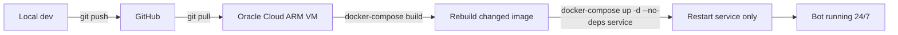

# AlphaDivision

A swing trading bot for US stocks, powered by Claude AI. Uses a hybrid approach — technical indicators filter candidates, Claude makes the final decision. Built as a microservices architecture on Oracle Cloud's free ARM tier.

---

## Architecture



---

## Data Flow



---

## Risk Rules



---

## Service Health



---

## Project Structure

```
alphadivision/
├── services/
│   ├── data/               # Fetches price, news, macro — publishes to Redis
│   │   ├── Dockerfile
│   │   ├── requirements.txt
│   │   ├── main.py
│   │   └── tests/
│   ├── analysis/           # Technical filter + Claude AI decisions
│   │   ├── Dockerfile
│   │   ├── requirements.txt
│   │   ├── main.py
│   │   └── tests/
│   ├── execution/          # Risk rules + order placement via Alpaca
│   │   ├── Dockerfile
│   │   ├── requirements.txt
│   │   ├── main.py
│   │   └── tests/
│   ├── alerts/             # Discord + email notifications
│   │   ├── Dockerfile
│   │   ├── requirements.txt
│   │   ├── main.py
│   │   └── tests/
│   └── dashboard/          # Flask web UI — responsive, mobile friendly
│       ├── Dockerfile
│       ├── requirements.txt
│       ├── main.py
│       └── tests/
├── tests/
│   └── integration/        # Cross-service integration tests
├── docker-compose.yml
├── docker-compose.test.yml
├── .env.example
├── CLAUDE.md
└── docs/
    └── superpowers/
        └── specs/
            └── 2026-05-15-trading-bot-design.md
```

---

## Setup

### 1. Clone and configure

```bash
git clone https://github.com/nickchow0/alphadivision.git
cd alphadivision
cp .env.example .env
# Fill in your API keys in .env
```

### 2. API keys required

| Service | Where to get it | Free tier |
|---|---|---|
| Alpaca | alpaca.markets | Yes (paper trading) |
| Anthropic | console.anthropic.com | Pay per token |
| Finnhub | finnhub.io | Yes (60 calls/min) |
| FRED | fred.stlouisfed.org | Yes (unlimited) |
| SendGrid | sendgrid.com | Yes (100 emails/day) |
| Tailscale | tailscale.com | Yes (100 devices) |

### 3. Run (paper trading)

```bash
docker-compose up -d
```

### 4. Run tests

```bash
# Unit tests
pytest services/

# Integration tests
docker-compose -f docker-compose.test.yml up -d
pytest tests/integration/
docker-compose -f docker-compose.test.yml down
```

### 5. Access the dashboard

Connect via Tailscale, then open `http://<vm-tailscale-ip>:8080` on any device.

---

## Deployment (Oracle Cloud)



> ⚠️ Never run `docker-compose down -v` in production — this deletes all data volumes.

---

## Design Spec

Full architecture decisions, alternatives considered, failure modes, and recovery procedures:
[`docs/superpowers/specs/2026-05-15-trading-bot-design.md`](docs/superpowers/specs/2026-05-15-trading-bot-design.md)
